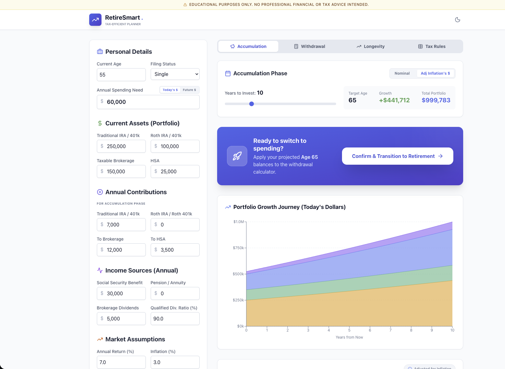

<div align="center">


# FiscalSunset: Tax-Efficient Withdrawal Strategist

[](https://choosealicense.com/licenses/mit/)
[](https://react.dev/)
[](https://www.typescriptlang.org/)
[](https://vitejs.dev/)

**A powerful retirement planning tool that implements sophisticated tax-efficient withdrawal strategies to help you keep more of your money in retirement.**

[Features](#-features) • [Demo](#-demo) • [Installation](#-installation) • [Usage](#-usage) • [Tech Stack](#%EF%B8%8F-tech-stack) • [Contributing](#-contributing) • [License](#-license)

</div>

---

## 📖 Overview

FiscalSunset is a comprehensive retirement planning calculator that helps you optimize your withdrawal strategy across multiple account types. It implements the "FiscalSunset Approach" to minimize taxes by analyzing your assets, and spending needs to generate an optimal withdrawal strategy.

The tool prioritizes tax-efficient withdrawals by:
- Leveraging 0% capital gains tax brackets
- Strategic Roth conversions based on tax bracket headroom
- Social Security benefit taxation optimization
- IRMAA (Medicare premium) cliff avoidance
- Senior deduction phase-out considerations

## ✨ Features

### 🏦 Multi-Account Support
- **Traditional IRA/401(k)** - Pre-tax retirement accounts with RMD tracking
- **Roth IRA** - Tax-free growth and qualified withdrawals
- **Taxable Brokerage** - Capital gains optimization with qualified dividend tracking
- **Health Savings Account (HSA)** - Triple tax-advantaged healthcare savings

### 📊 Integrated Planning Modules

| Module | Description |
|--------|-------------|
| **Accumulation** | Pre-retirement savings strategy and growth projections |
| **Withdrawal** | Tax-optimized withdrawal sequence recommendations |
| **Longevity** | Asset depletion analysis with projections |
| **What-If Analysis** | Side-by-side comparison of different savings strategies and long-term tax impacts |
| **FIRE Analysis** | Early retirement milestone tracking (Lean, Coast, Barista, Fat) |
| **Reference** | Comprehensive guide: how-to, tax strategies, 2026 tax brackets, and disclaimers |


### 🧠 Smart Tax Optimization
- **Two-Layer Cake Method** - Optimal stacking of ordinary income and capital gains
- **Social Security "Torpedo" Detection** - Avoid 50-85% benefit taxation zones
- **IRMAA Cliff Awareness** - Medicare premium surcharge avoidance
- **RMD Calculations** - Automatic Required Minimum Distribution tracking (age 73+)
- **Roth Conversion Optimizer** - "Fill Strategy" algorithm for optimal conversions

### 🤖 AI-Powered Insights (Optional)
- Integrated Google Gemini AI for personalized financial advice
- Contextual recommendations based on your specific situation
- Withdrawal rate analysis against the 4-5% rule of thumb

### 📈 Portfolio Modeler & Monte Carlo Simulator
- **Visualizer**: see the probability of success for different portfolio allocations
- **Customization**: Build your own portfolio or use preset strategies (Conservative, Moderate, Aggressive) tailored for Accumulation vs. Retirement.
- **Monte Carlo Engine**: Runs 10,000 simulations to project likely (median), unlucky (10th percentile), and lucky (90th percentile) return scenarios based on historical asset data (VTI, VXUS, BND, BNDX).

### 🎨 Modern UI/UX
- **Guided Onboarding Wizard** - Simplifies data entry for new users
- **Educational Tooltips** - In-app explanations for complex tax concepts
- Responsive design works on desktop and mobile
- Dark/Light mode toggle
- Interactive charts powered by Recharts
- Real-time calculation updates
- **Local Persistence** - Auto-saves your data to your device (IndexedDB)
- **Privacy First** - Zero-data collection; everything runs client-side

## 🚀 Demo

The application is live and free to use at **[fiscalsunset.com](https://fiscalsunset.com)**.

It runs entirely in the browser as a static site hosted on S3. Your financial data never leaves your device (unless you use the optional AI advisor feature), thanks to local `IndexedDB` persistence.

## 📋 Prerequisites

Before you begin, ensure you have the following installed:

- **Node.js** (v18.0.0 or higher) - [Download here](https://nodejs.org/)
- **npm** (v9.0.0 or higher) - Comes with Node.js
- **Git** - [Download here](https://git-scm.com/)

## 💾 Installation

### Clone from GitHub

```bash
# Clone the repository
git clone https://github.com/<your-org>/FiscalSunset.git

# Navigate to the project directory
cd FiscalSunset

# Install dependencies
npm install
```

### API Key Configuration

The application uses Google Gemini for optional AI insights. 
- You do **not** need an environment variable.
- Simply click the **Settings (Gear Icon)** in the top right of the application to enter your key locally.
- Your key is stored securely on your own device.

To obtain a Gemini API key:
1. Visit [Google AI Studio](https://aistudio.google.com/)
2. Sign in with your Google account
3. Navigate to API Keys section
4. Create a new API key

## 🛠️ Development

### Run Locally

You can run the application in two modes:

**1. Web Mode (Browser)**
Runs as a standard web application in your default browser.
```bash
npm run dev -- --mode web
```

**2. Desktop Mode (Electron)**
Runs as a native desktop application window.
```bash
npm run dev
```

The application will be available at `http://localhost:5173` if running in web mode.

The application will be available at `http://localhost:5173` (or the next available port).

### Build for Production

```bash
# Create an optimized production build
npm run build

# Web-only production build
npm run build:web

# Preview the production build locally
npm run preview
```

### Deployment

#### Option 1: Static Web Hosting (AWS S3, GCS, Netlify, etc.)
You can generate a static distribution folder to host the web version anywhere.

```bash
# Generate the 'dist' folder
./prepare-dist.sh

# Or run the equivalent npm script sequence manually
npm run build:web
```

This creates a `dist/` folder containing the static site (including `index.html` and `assets/`).

You can validate the built output locally with:

```bash
npm run preview
# or serve the static folder directly
npm run start
```

Upload the contents of `dist/` to your static host.

### Project Structure

```
fiscal-sunset/
├── src/                               # Application source
│   ├── assets/images/                 # UI imagery
│   ├── components/                    # React components
│   │   ├── common/                    # Shared UI primitives
│   │   ├── features/                  # Feature modules and wizard steps
│   │   ├── layout/                    # Layout components
│   │   └── modals/                    # Modal dialogs
│   ├── constants/                     # App constants
│   ├── services/                      # Calculation engines & integrations
│   ├── types/                         # TypeScript domain models
│   ├── utils/                         # Utility helpers
│   ├── App.tsx                        # Root app component
│   └── index.tsx                      # Browser entry point
├── public/Images/                     # Public static image assets
├── index.html                         # HTML entry document
├── metadata.json                      # App metadata
├── prepare-dist.sh                    # Dist preparation helper
├── readme-local-install.md            # Supplemental install notes
├── vite.config.ts                     # Build/dev tooling config
├── tsconfig.json                      # TypeScript config
├── package.json                       # Scripts & dependencies
└── README.md                          # Project documentation
```


## 🧪 Docs Sanity Checklist

When updating scripts, moving files, or refactoring folders, run this checklist before merging:

- Confirm every command in this README exists in `package.json` scripts (or is a direct shell script in the repo, like `./prepare-dist.sh`).
- Confirm all referenced directories/files in **Project Structure** actually exist in the repository.
- If you rename/move files, update both README references and any related docs (for example `readme-local-install.md`).
- Re-render README in a GitHub-style markdown preview to catch broken fences, lists, and headings.

## 🧱 Services Architecture

The business logic of FiscalSunset is decoupled from the UI layer into distinct service modules located in `src/services/`:

- **`calculationEngine.ts`**: The core "tax brain" of the application. It handles complex IRS rules including the "Two-Layer Cake" tax calculation, RMD requirements, Social Security taxation, and the "Fill Strategy" algorithm for optimal Roth Conversions.
- **`fireCalculations.ts`**: Specialized math for the early retirement community. Projects when users will achieve various FIRE milestones (Lean, Barista, Coast, Standard, Fat) based on real rate-of-return models.
- **`MonteCarloEngine.ts`**: Statistical engine evaluating portfolio viability. Runs 10,000-iteration probability simulations using Geometric Brownian Motion and historical asset correlations (VTI, VXUS, BND, BNDX).
- **`projection.ts`**: Handles deterministic asset accumulation projections prior to retirement, factoring in inflation, growth assumptions, and recurring contributions.
- **`geminiService.ts`**: AI integration layer. Constructs highly detailed, context-aware prompts encapsulating the user's entire financial state to securely query the Google Gemini API for fiduciary-style advice.
- **`db.ts`**: The local persistence layer. Implements Dexie.js to interface with the browser's IndexedDB, ensuring user profiles and API keys are stored securely on the device without any external database.

## ⚙️ Tech Stack

| Technology | Purpose |
|------------|---------|
| **React 19** | UI Framework with latest features |
| **TypeScript 5.8** | Type-safe JavaScript |
| **Vite 6** | Next-generation frontend tooling |
| **Recharts** | Interactive charting library |
| **Lucide React** | Beautiful icon library |
| **Dexie.js** | Wrapper for IndexedDB (Local Database) |
| **Google Gemini AI** | Optional AI-powered insights |

## 🧠 Calculation Methodology

FiscalSunset uses a deterministic projection model with high-fidelity tax calculations. Unlike simple calculators that use effective tax rates, this engine simulates the actual IRS Form 1040 logic for every year of the projection using 2026 estimates.

### 1. The Tax Engine ("Two-Layer Cake")
The application calculates federal taxes using the standard IRS method where **Ordinary Income** sits at the bottom and **Capital Gains/Dividends** sit on top.

*   **Ordinary Income:** Wages, Interest, Pension, Traditional IRA withdrawals, and Taxable Social Security.
*   **Capital Gains:** Qualified Dividends and Long-Term Capital Gains from brokerage sales.
*   **Deductions:**
    *   **Standard Deduction (2026):** ~$16,100 (Single) / $32,200 (Married).
    *   **Age 65+ Catch-up:** Adds ~$2,050 (Single) / $1,650 (Married).
    *   **OBBBA Senior Deduction:** Modeled 2025-2028 deduction of up to $12,000 for seniors, including phase-out logic ($1 reduction per $0.06 over thresholds).

### 2. Withdrawal Priority ("FiscalSunset Approach")
To minimize lifetime tax liability, the engine withdraws assets in a specific order to fill the spending gap:

1.  **Required Minimum Distributions (RMDs):** Mandatory withdrawals from Traditional IRAs starting at age 73 (using Uniform Lifetime Table).
2.  **Taxable Brokerage:** Sold first to take advantage of 0% Capital Gains brackets.
3.  **Roth IRA (Basis):** Contributions are withdrawn tax/penalty-free.
4.  **Traditional IRA:** Withdrawn up to top of low tax brackets or to fill standard deduction.
5.  **Roth IRA (Earnings):** Accessed last to maximize tax-free growth.
6.  **HSA:** Treated as long-term care/medical reserve (last resort).

*Early Retirement (FIRE) Logic:*
If the user is under 59.5, the engine automatically simulates:
*   **SEPP / 72(t) Payments:** Calculates substantially equal periodic payments to access Traditional IRA funds penalty-free.
*   **Rule of 55:** Simulates penalty-free access if applicable.
*   **Penalty Withdrawals:** Only triggers 10% penalty if no other liquidity sources exist.

### 3. Roth Conversion Optimizer ("Fill Strategy")
The "Strategy" tab runs an optimization loop to recommend Roth Conversions. It identifies "Headroom" in your current tax situation and recommends converting Traditional IRA funds to fill that space, up to the nearest "Cliff."

**Constraints Checked:**
*   **Tax Bracket:** Fills up to the top of the 10%, 12%, or 22% bracket.
*   **IRMAA Cliffs:** Prevents conversion from triggering higher Medicare Part B/D premiums (e.g., crossing $212k MAGI).
*   **Social Security "Torpedo":** Detects the effective marginal rate spike (up to 49.95%) caused by the taxation of Social Security benefits and advises restricting conversions in this zone.

### 4. Longevity Projection
The Longevity tab projects assets up to age 100.
*   **Inflation:** Spending needs are inflated annually by the `Inflation Rate` (default 2.5-3.0%).
*   **Growth:** Remaining assets grow by the `Rate of Return` (distinct rates for Accumulation vs. Retirement phases).
*   **Depletion Order:** For the longevity visualizer, assets are burned down sequentially: Brokerage → Traditional IRA → Roth IRA → HSA.
*   **Income Composition:** Tracks the shifting mix of fixed income (SS, Pension) vs. Portfolio Withdrawals over time to show how the "Paycheck" is constructed.

### 5. Monte Carlo Simulation
The optional Portfolio Modeler uses Geometric Brownian Motion to simulate 10,000 possible market paths for your customized portfolio.
*   **Asset Classes:** Uses historical return and volatility data for US Stock (VTI), Int'l Stock (VXUS), US Bond (BND), and Int'l Bond (BNDX).
*   **Correlations:** Implements a correlation matrix to account for how assets move in relation to one another (diversification benefit).
*   **Outputs:** Proves a statistical "range of outcomes" rather than a single static guess, helping you choose a more robust Annual Return assumption.

## 🤝 Contributing

Contributions are welcome! Here's how you can help:

### Getting Started

1. Fork the repository
2. Create a feature branch (`git checkout -b feature/amazing-feature`)
3. Commit your changes (`git commit -m 'Add some amazing feature'`)
4. Push to the branch (`git push origin feature/amazing-feature`)
5. Open a Pull Request

### Development Guidelines

- Follow TypeScript best practices
- Maintain consistent code formatting
- Add comments for complex tax calculations
- Update tests if applicable
- Update documentation as needed

### Reporting Issues

Found a bug or have a feature request? Please [open an issue](https://github.com/meva/retiresmart-tax-efficient-withdrawal-strategist/issues) with:

- Clear description of the problem/feature
- Steps to reproduce (for bugs)
- Expected vs actual behavior
- Screenshots if applicable

## ⚠️ Disclaimer | 🛑 LEGAL DISCLAIMER

> **This tool is for educational purposes only.**
> 
> FiscalSunset does not provide professional financial, tax, legal, or investment advice. The calculations and strategies presented are based on general tax rules and may not account for your complete financial situation.
> 
> Always consult with a qualified financial advisor, tax professional, or fiduciary before making any financial decisions. Tax laws change frequently, and individual circumstances vary significantly. USE AT YOUR OWN RISK! By using this code, you agree that the author is not liable for any financial loss, IRS penalties, or "tax torpedoes" you may encounter.


## 📄 License

This project is licensed under the MIT License - see the [LICENSE](LICENSE) file for details.

```
MIT License

Copyright (c) 2025 FiscalSunset

Permission is hereby granted, free of charge, to any person obtaining a copy
of this software and associated documentation files (the "Software"), to deal
in the Software without restriction, including without limitation the rights
to use, copy, modify, merge, publish, distribute, sublicense, and/or sell
copies of the Software, and to permit persons to whom the Software is
furnished to do so, subject to the following conditions:

The above copyright notice and this permission notice shall be included in all
copies or substantial portions of the Software.

THE SOFTWARE IS PROVIDED "AS IS", WITHOUT WARRANTY OF ANY KIND, EXPRESS OR
IMPLIED, INCLUDING BUT NOT LIMITED TO THE WARRANTIES OF MERCHANTABILITY,
FITNESS FOR A PARTICULAR PURPOSE AND NONINFRINGEMENT. IN NO EVENT SHALL THE
AUTHORS OR COPYRIGHT HOLDERS BE LIABLE FOR ANY CLAIM, DAMAGES OR OTHER
LIABILITY, WHETHER IN AN ACTION OF CONTRACT, TORT OR OTHERWISE, ARISING FROM,
OUT OF OR IN CONNECTION WITH THE SOFTWARE OR THE USE OR OTHER DEALINGS IN THE
SOFTWARE.
```

## 🙏 Acknowledgments

- Tax strategy concepts inspired by various retirement planning resources
- Built with [React](https://react.dev/) and [Vite](https://vitejs.dev/)
- Icons by [Lucide](https://lucide.dev/)
- Charts by [Recharts](https://recharts.org/)
- Built with [Google Gemini](https://aistudio.google.com/) and using AntiGravity 


---

<div align="center">

**Made with ❤️ for a better retirement**

⭐ Star this repo if you find it helpful!

</div>
